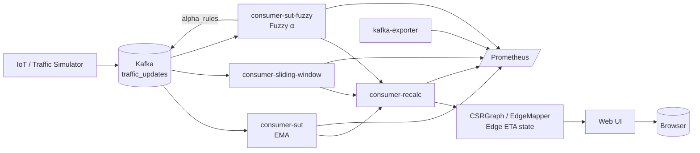
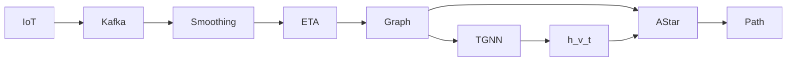
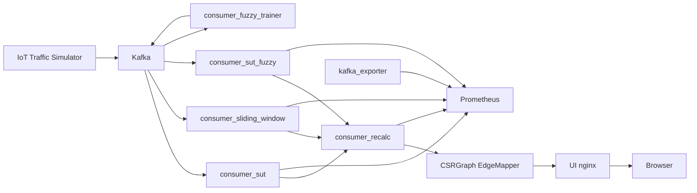
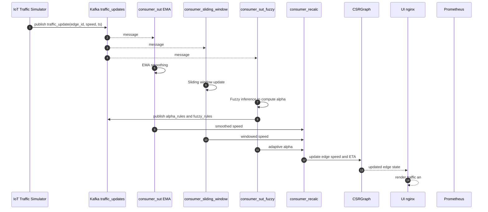

# iot-roadtraffic-realtimeupdate

Real-time Internet-of-Vehicles (IoV) platform for dynamic road-traffic monitoring and ETA-aware routing on a road network using Kafka streaming, adaptive smoothing, fuzzy inference, and TGNN-based A* heuristics.

The system continuously ingests traffic events from moving vehicles, updates time-dependent edge weights of a road graph, and provides the foundation for **time-dependent shortest-path routing** using **TGNN-driven heuristics**.

This project serves as a **digital twin of a real road network (Irpin)** and a research backend for **machine-learning-assisted routing in dynamic graphs**.

---

## 🧭 High-level architecture

---

## 🧠 What the system does

The system builds a time-dependent weighted road graph from streaming IoT events.

Each edge e has a weight: w(e, τ) = ETA_e(τ)

which changes in real time based on vehicle speed, congestion, and uncertainty.

Multiple estimators operate in parallel:

  - EMA (Exponential Moving Average)
  - Sliding window average
  - Fuzzy-logic-controlled EMA

Their outputs are combined to update the graph state used for routing.

## 🗺 Road graph

The road network is loaded from irpin_drive_graph.graphml

It is converted to a Compressed Sparse Row (CSR) structure for fast access.

Each edge stores:

  - length
  - current speed
  - ETA
  - historical buffers

Implemented in:
  - csr_graph.py
  - edge_mapper.py

## 📡 Kafka topics

traffic_updates --> Raw IoT traffic events
fuzzy-rules ->> Learned fuzzy rules
alpha_rules ->> Adaptive EMA coefficients

Example message

{
  "edge_id": 15342,
  "speed_kph": 32.4,
  "length_m": 180.0,
  "ts": "2026-01-12T10:15:00Z"
}

## 🧠 Adaptive smoothing
For each edge: v_t = α · x_t + (1 − α) · v_{t−1} 

The smoothing coefficient α is inferred using fuzzy logic based on:
  - speed variance
  - congestion
  - temporal dynamics

Distances used:
  - Mahalanobis
  - Bhattacharyya

This allows:
  - High volatility → stronger smoothing
  - Stable traffic → more responsiveness

## 🧠 Fuzzy rule learning

consumer-fuzzy-trainer clusters streaming data and builds fuzzy rules that map traffic patterns to optimal α values.

These rules are published back to Kafka and used online by the inference service.

## 🔍 End-to-end routing pipeline

## Dataflow/pipeline diagram

## 📊 Observability

Prometheus metrics:
  - http://localhost:9101/metrics
  - http://localhost:9102/metrics
  - http://localhost:9103/metrics
  - http://localhost:9104/metrics
  - http://localhost:9308/metrics

Kafka lag is monitored via kafka-exporter.

## 🌐 Web UI

http://localhost:8080

Provides:
  - live traffic
  - edge ETA
  - 2D / 3D views

## ▶️ Run the system

docker compose up --build

## 🎓 Research goal

This project is a real-time experimental platform for learning and evaluating TGNN-based heuristics for time-dependent A* routing in large-scale IoV systems.

## ▶️ Running the traffic simulator

To generate real-time IoT traffic events, use the async simulator:

  python async_simulator.py -k 3000 -c 200 -s 2

  - k - Number of Kafka messages to send (total events)
  - c - Number of concurrent simulated vehicles (producers)
  - s - Send interval in seconds between message batches  

## License

MIT
